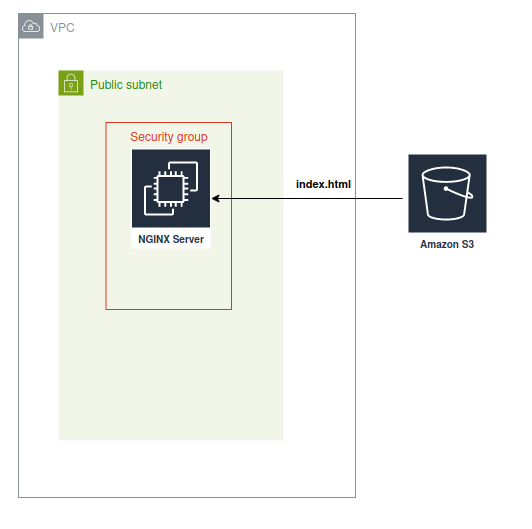

# Problem to Be Solved in This Lab
 In this lab you need to deploy custom nginx server to a dedicated server. You provided with Terraform configuration that should do this but looks like it contains several issues.
 You should fix all of them and succesful run nginx server with custom `index.html` page.

### Deployment diagram

 
### Explanation of the Solution 
- You will use Terraform with cloud provider to create Nginx infrastructure: VPC, Network, Security groups, S3 bucket and Compute.
- You should fix any error you've faced but you shouldn't remove resources.
- You can change or add resources if it required.
- All changes should be done in a Fork repository.

### Task

You have to fix any errors that prevents configuration to be applied.

**Hint**: Check every resource parameters carefully. Carefull read documentation about [provisioners](https://developer.hashicorp.com/terraform/language/resources/provisioners/syntax). Especialy [this](https://developer.hashicorp.com/terraform/language/resources/provisioners/syntax#creation-time-provisioners) section.

Change the content of index.html file with adding you name to a message like "This is Terraform task by John Dow". Use variable student_name.

#### Definition of Done:

Configfiguration applied with no errors. You can reach Nginx server via public IP address and receive custom page with text "This is Terraform task by {Your name}".

That it.

